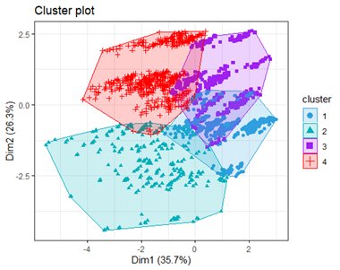

# Clustering Loan Customers

Customer segmentation analysis using K-Means clustering for a loan company.

---

## Objective

Perform customer segmentation based on demographic and financial attributes to identify potential marketing or service strategies.

---

## Methodology

1. **Dataset**: 
   - Input data from `CustomerProfileData.csv`, which includes demographic and financial details such as age, income, education, occupation, and marital status.

2. **Clustering Technique**:
   - Applied **K-Means Clustering** in R to segment customers into groups.
   - Determined the optimal number of clusters using the **Elbow Method**.

3. **Visualization**:
   - Created cluster plots to represent data distribution and group characteristics.

4. **Analysis**:
   - Segments analyzed to interpret cluster characteristics, such as high-income vs. low-income groups, urban vs. rural customers, etc.

---

## Results

### Insights:
- **Key Segments Identified**:
  - Cluster 1: High-income professionals from urban areas.
  - Cluster 2: Low-income individuals from rural communities.
  - Additional clusters highlight patterns in demographics and financial behavior.

### Key Visuals:
- **Cluster Plot**:
  - 
- **Segmented Customer Data**:
  - See details in `ClusteredData_4Clusters.xlsx`.

---

## Tools

- **Programming Language**: R
- **Libraries Used**:
  - `ggpubr` for visualizations.
  - `factoextra` for clustering analysis.
  - Core R functions for data manipulation and plotting.
- **Dataset**:
  - `CustomerProfileData.csv`

---

## Dependencies

To replicate this project, you need:
- R (Version 4.0+)
- Required libraries:
  - `ggpubr`
  - `factoextra`
  - `cluster`

---

## Future Enhancements

- Analyze larger datasets with additional variables such as credit score or purchasing history.
- Apply hierarchical clustering for comparison.
- Automate customer recommendations based on segments.

---

## Disclaimer

This project was completed as part of an MBA Data Mining course and is for educational purposes only.

---

## How to Run

1. Clone the repository:
   ```bash
   git clone https://github.com/AJ1522/clustering-loan-customers.git
2. Open clustering_analysis.R in RStudio.
3. Install required libraries
   ```bash
   install.packages("ggpubr")
   install.packages("factoextra")

4. Run the script to generate clusters and visualizations.

